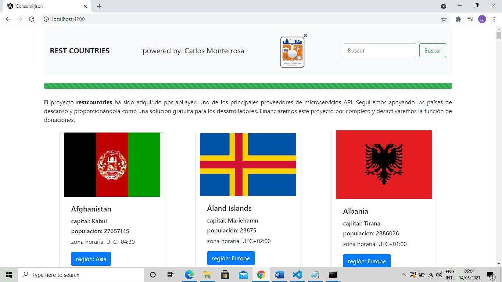

# Consumir un servicio Web que devuelva datos en formato JSon

This project was generated with [Angular CLI](https://github.com/angular/angular-cli) version 11.2.9.

# Prueba de concepto 
 
 
<!-------->

## Development server

Run `ng serve` for a dev server. Navigate to `http://localhost:4200/`. The app will automatically reload if you change any of the source files.

